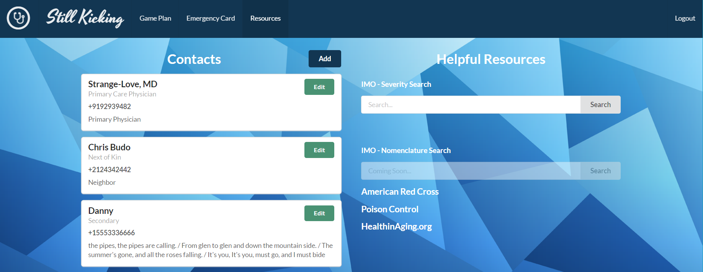

#Still Kicking

In 2014 the the 65+ population in the United States represented 14.5% of the population. By 2040 that number will grow to 21.7%. 

With relatives also growing older, more and more young and middle-aged adults find  themselves assuming the mantle of a Caregiver, either helping out remotely or moving in.

Unofficial caregivers come from all backgrounds, ranging from teachers to college students, to stay at home parents and businessmen and women. Most of them have a few things in common though, a strong will to help, but a weak understanding as to how.


**That is where _Still Kicking_ enters the picture**

Our Open Source Solution is setup to span the full range of unofficial caregiving from mostly independent seniors whose relatives just want to check in and know things are okay to less than independent seniors whose relatives take care manage everything from food, to laundry, to medication. 

### What We Offer

As a team, we understood unofficial caretaking as a balance between three things: A slow transition of control, a shuffling of responsibilities between siblings and loved ones, and the call you hope to never get.

#### Transition of Control
Our Game Plan module starts off simple - tracking medication. By taking inventory of the medicine cabinet, you can ensure everything the doctor has prescribed is taken on time and with the right accompaniments .


#### Shuffling of Responsibilities and Caretakers
Utilizing a single account structure allows the application be shared at a moment's notice, ensuring nothing falls through the cracks. 

This approach is furthered with a module dedicated to getting new care takes up to speed with emergency and medical contacts, a medical Severity Search box from IMO and a collection of helpful resources and tutorials. 



##### The Call
The drop what you doing, run to the car, and gun it before taking another breath, call. The phone call and mad rush to the hospital where one gut-wrenching feeling is in the front of your mind and everything else is forgotten. Everything, from if the stove was left on, to the list of medication he was on including the name of the big blue one.

The emergency card takes all of the information from the game plan and clearly display what drugs he is on when they were last taken all his or her emergency medical conditions.


###Build Installation  Instructions
```bash
git clone clone git@github.com:Doolan/StillKicking.git
cd ----
browserify app.js >bundle.js #build the bundle package
watchify app.js -o bundle.js #watches for updates and refreshes the bundle script 
npm install #installs all of the packages
npm start #launches the site on http://localhost:3000/
```
###_Required Tools_
_Install these first_

1. [Node.js](https://nodejs.org/en/)
2. [Git](https://desktop.github.com/)
3. nodemon
```bash
npm install -g nodemon
npm install -g browserify
npm install -g gulp
```

[**Database and Backend information can be found here:**](https://github.com/cbudo/StillKickingMeBack)

[**Contributor Guide**](https://github.com/Doolan/StillKicking/blob/master/CONTRIBUTING.md)

[**LICENSE**](https://github.com/Doolan/StillKicking/blob/master/LICENSE)

